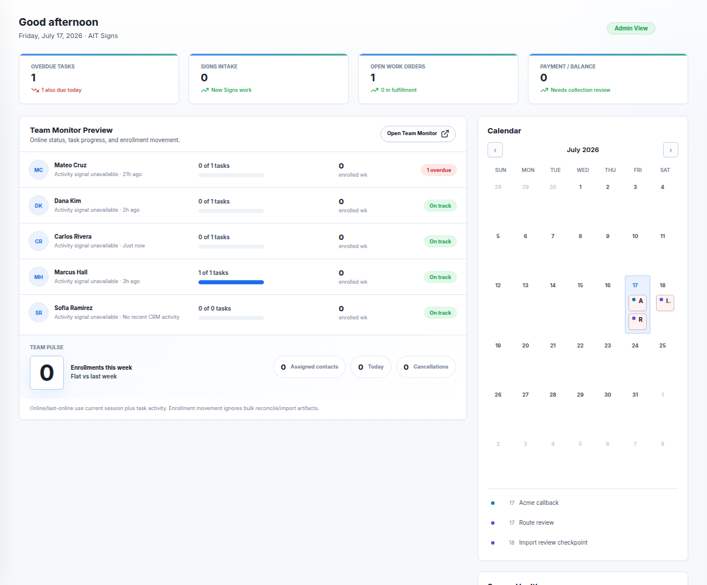
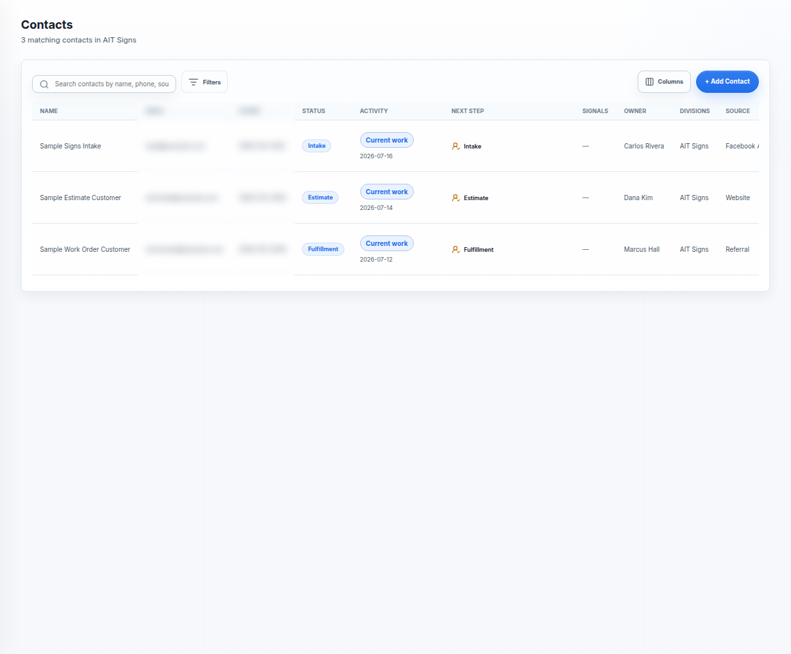
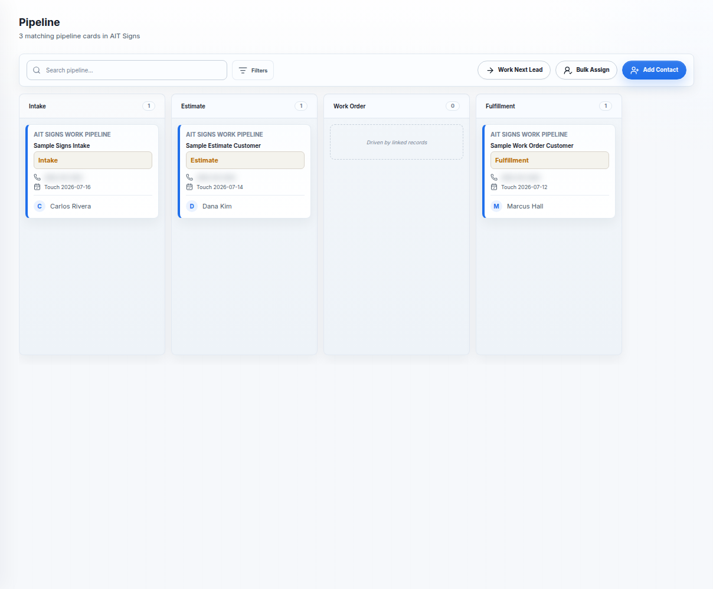
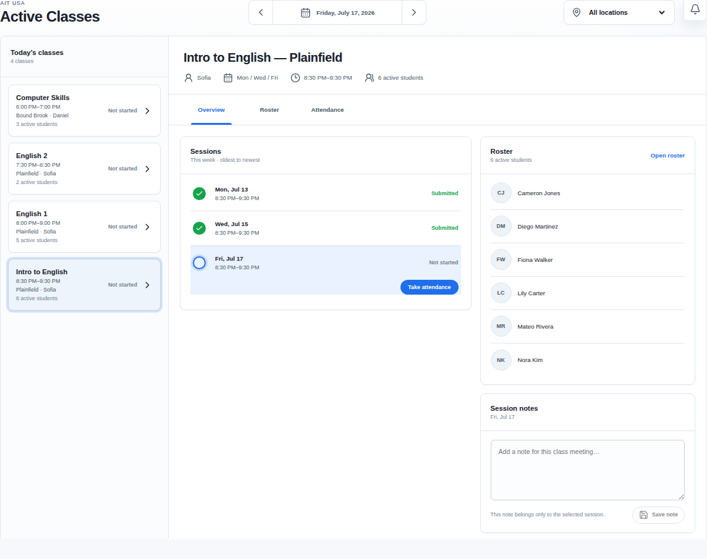
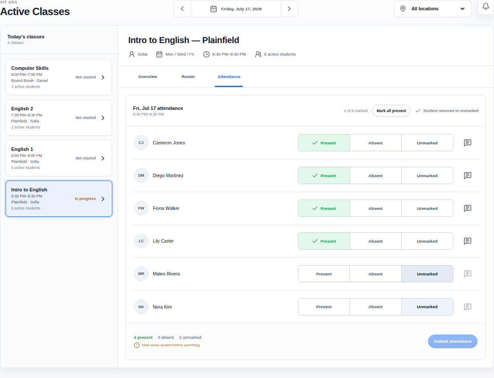

# AIT CRM User Guide

AIT CRM adapts to your account role and selected business unit. You may see fewer navigation items or actions than another employee; that is intentional. Access is determined by the server, not by a visual mode switch.

Screenshots in this guide use synthetic local demo records. Email and phone fields are visibly redacted where they appear; no production customer data is shown.

## Sign in and select your scope

1. Sign in with the account issued by an administrator.
2. Confirm the business unit shown in the division selector.
3. Change divisions only when your account has access and the work belongs in that division.
4. Contact an administrator if a required workspace is missing. Do not share your password in a support message.

Administrators can work across permitted divisions. Coordinators, designers, and managers see the records and actions assigned to their role and business-unit memberships.

## Main workspaces

- **Dashboard** — current activity, follow-up priorities, and operational summaries.
- **Contacts** — customer and student records, source context, notes, history, and related work.
- **Pipeline** — lead stages and next-action management.
- **Tasks** — assigned work, due dates, priorities, and completion tracking.
- **Active Classes** — class rosters, dated sessions, attendance, and session notes for AIT USA Institute.
- **Team Monitor** — senior-level workload and progress visibility.
- **Work Orders** — AIT Signs production and installation work.
- **Import Review** — controlled review of staged records before promotion.
- **Financials and Reports** — authorized operational and management views; QuickBooks remains the accounting source of truth.
- **Settings and operational tools** — administrator-only configuration and diagnostics.

Workspace availability follows the deployed release channel and your account permissions.

### Dashboard

Use the Dashboard to scan current priorities before opening a detailed workspace. It combines operational counts, team progress, the calendar, and task context for the selected business unit.

### Contacts

Contacts is the primary record directory. Search by the available identity or operational fields, use filters to narrow the current scope, and open a record before making an outreach or data decision.

### Pipeline

Pipeline presents the same current work as a stage-based board. Use it to identify the next lead, review ownership, and move a record only when its real operating state has changed.

## Daily contact and lead workflow

1. Start from Dashboard, Tasks, or Pipeline to identify the next action.
2. Open the Contact before outreach and review the source, recent notes, tasks, and activity history.
3. Record the outcome of a call, message, meeting, or correction in the CRM.
4. Update the lead stage only when the new stage reflects the real customer state.
5. Create or complete the next task so ownership is clear.
6. Use Work Orders only when AIT Signs work is ready for production or installation tracking.

When a contact looks duplicated or the source information conflicts, stop and ask for review. Do not merge or overwrite uncertain identity data simply to clear a queue.

## Active Classes and attendance

Active Classes is organized class-first. Select the date, then choose a class from the class rail.

### Overview

The Overview tab contains only the information needed to orient the employee:

- dated sessions in chronological order
- the attendance state for each session
- a roster preview
- a session note tied to the selected date

Selecting another session changes the note and attendance context. A note-only session remains **Not started** until at least one attendance mark exists.

### Roster

The Roster tab shows all active enrollments for the class.

- Regular coordinators see student names as plain text.
- Senior coordinators and administrators may open authorized Contact profiles from student names.
- The absence of a link does not mean the enrollment is missing; it reflects the user's Contact-detail permission.

### Quick Mark attendance

1. Choose the intended date and class.
2. Open **Attendance** or select **Take attendance** from the current session.
3. Mark each student **Present** or **Absent**. Unmarked is a deliberate third state.
4. Add a student-specific note only when it provides useful attendance context.
5. Review the present, absent, and unmarked totals.
6. Submit only after every active student is marked.

Submitted attendance is read-only. A senior coordinator or administrator can reopen it when a correction is required; the reopen action is audited. If another employee or browser tab saved a newer revision, reload the current session before trying again.

Session notes and attendance are saved independently. Updating the Overview note cannot replace attendance marks, and updating attendance cannot erase the session note.

## Tasks and Team Monitor

- Use Tasks for work that has a clear owner and follow-up date.
- Keep titles specific and use the description for the context another employee needs to finish the task.
- Complete a task only when the work is actually resolved.
- Senior coordinators and administrators use Team Monitor to review workload and progress within their authorized scope.

## Work Orders and operational financials

- Create a Work Order when an AIT Signs job is ready for operational tracking.
- Keep status, owner, priority, and customer context current.
- Generated documents reflect CRM operational data and should be reviewed before they are sent externally.
- Financials and Reports provide operational visibility; accounting corrections remain in QuickBooks.

## Import Review

Import Review protects live CRM records from uncertain source data.

1. Review the source reference and normalized fields.
2. Approve only clear mappings.
3. Leave uncertain rows in `needs_review` or reject them with a reason.
4. Run the approved dry-run and verification process before promotion.
5. Never force a contact match, class match, or phone replacement to make the queue smaller.

Production promotions are administrative operations and remain separately approval-gated.

## Privacy and support

- Do not place passwords, API keys, webhook secrets, or database URLs in notes or support tickets.
- Avoid sharing screenshots that contain customer phone numbers, email addresses, street addresses, or message content.
- If a screenshot is necessary, crop to the relevant area and fully redact private fields before sharing.
- For a data issue, provide the record name, business unit, affected workflow, source reference when available, and a description of what is wrong. Send private identifiers only through the approved support channel.
- Sign out on shared devices and do not reuse another employee's session.

## Troubleshooting

- **A workspace is missing:** confirm the selected division, then ask an administrator to review your role and memberships.
- **A save reports a newer revision:** reload the session or record, review the newer data, then apply your change again.
- **Attendance cannot be submitted:** mark every active student or resolve the unmarked count.
- **Submitted attendance needs correction:** ask a senior coordinator or administrator to reopen the session.
- **A website lead is missing:** provide the website or form, approximate submission time, business unit, and source reference. Never include webhook credentials.
- **Imported data looks wrong:** do not manually hide the mismatch; preserve the source reference and request review.
